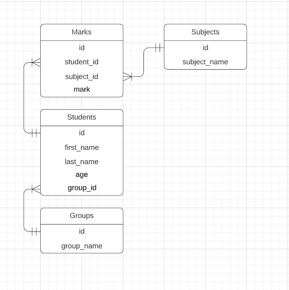
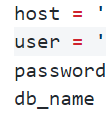

# Лабораторна робота № 2

### Створення додатку бази даних, орієнтованого на взаємодію з СУБД PostgreSQL

#### 🔨 Мова програмування: Python 3.9.5

#### 🗃️ База даних: PostgreSQL

#### 🧱 Залежності описані в файлі requirements.txt

### Вміст

#### Схема БД



### Як запустити застосунок

Створіть config.py та запишіть дані у такі поля

## 

```
git clone https://github.com/art-litv/DB-Course/tree/main/lab2

cd [path to the repository folder]

venv\Scripts\activate

py main.py
```
